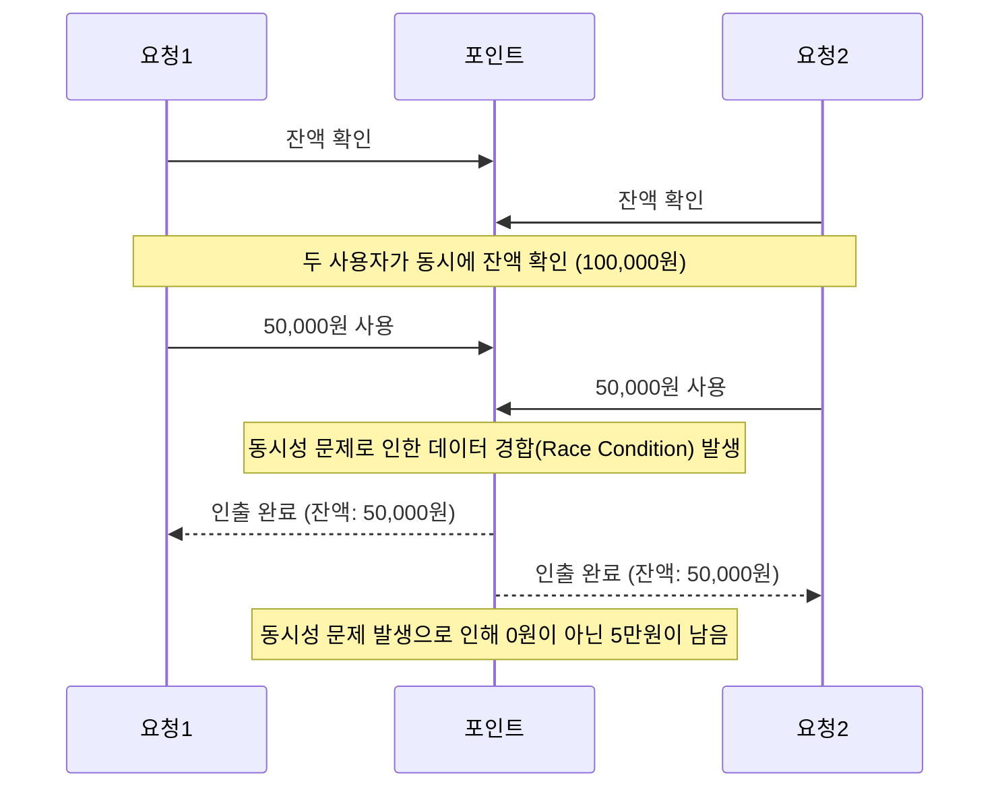

# 동시성 제어 방식에 대한 분석 및 보고서

## 동시성 제어가 필요한 이유

애플리케이션을 사용하는 사용자가 동시에 똑같은 자원에 접근하는 상황이 발생할 수 있습니다.
이때, 동시에 사용자가 자원에 접근하여 데이터를 변경하려고 할 때, 동시성 문제가 발생할 수 있습니다.

다음과 같이 동시에 포인트 사용을 하는 경우 동시성 문제가 발생할 수 있습니다. 


위의 상황 처럼 동시성 문제가 발생하면 데이터의 무결성, 일관성이 깨질 수 있습니다.

## 현재 프로젝트에서 고려한 동시성 제어 방식

### syncronized를 이용한 동시성 제어

synchronized는 자바의 기본적인 동시성 제어 방식으로, 
객체의 **모니터 락(Monitor Lock)** 을 사용하여 한 번에 하나의 쓰레드만 동기화된 코드 블록에 접근할 수 있게 합니다. 

자바에서 모든 객체는 모니터 락을 가지고 있으며, 쓰레드가 synchronized 블록에 진입하면 해당 객체의 모니터 락을 획득하게 됩니다.

- 장점
  - synchronized 키워드만으로 동기화를 쉽게 적용할 수 있습니다.
  - 락을 획득하는 과정과 해제를 자동으로 처리해주기 때문에 사용하기 쉽습니다.
- 단점
  - 타임아웃이나 공정성을 보장할 수 없으며, 데드락이 발생할 수 있습니다. 
  - 세밀한 제어가 불가능하며, 하나의 객체에 대해서만 동기화를 제공합니다.


### ReetrantLock을 이용한 동시성 제어

ReentrantLock은 자바에서 제공하는 Lock 클래스로 수동으로 락을 관리해야 하며, 락 획득과 해제를 명시적으로 수행해야 합니다.

ReetrantLock은 다음과 같은 기능을 지원합니다.
- Lock polling
  - tryLock() 메서드를 통해 락을 대기하지 않고 즉시 반환받을 수 있습니다. 락을 얻지 못하면 다른 작업을 수행하는 방식입니다.
- Fairness
  - 생성자에서 공정성 여부를 설정할 수 있습니다. 공정성을 설정하면, 락을 요청한 순서대로 쓰레드가 락을 획득하게 됩니다.
    ```kotlin
    val lock = ReentrantLock(true)
    ```
- Condition 
  - Condition 객체를 통해 락을 획득한 쓰레드가 특정 조건이 만족될 때까지 대기하거나 조건이 충족되면 실행할 수 있습니다.
- 락 인터럽트
  - lockInterruptibly() 메서드를 사용하여 대기 중인 쓰레드가 인터럽트될 수 있습니다.
- 락 타임아웃
  - 락을 기다리는 동안 타임아웃을 설정할 수 있습니다. 
  - tryLock(long time, TimeUnit unit) 메서드를 사용하여 일정 시간 동안만 락을 기다리고, 그 시간이 지나면 락을 획득하지 못하면 실패를 반환합니다.

## 동시성 제어 방식 비교

### 코드 블록
- 장점
  - 별도의 복잡한 구조를 만들 필요가 없어 간단하게 동시성을 제어할 수 있습니다.
- 단점
  - 경합이 심해지면 성능이 저하될 수 있습니다. 모든 쓰레드가 같은 자원을 기다리므로 병목 현상이 발생할 수 있습니다.
### Queue
- 장점
  - FIFO(선입선출) 방식으로 작업 순서가 보장되며, 경합 없이 순차적으로 자원에 접근할 수 있습니다.
- 단점
  - 큐를 구현하고 관리하는 데 추가적인 복잡성이 필요합니다.

## 동시성 제어를 위해 선택한 방식
ReetrantLock + 코드 블록을 이용하여 동시성 제어를 진행했습니다.

나중에 ReetrantLock을 이용하여 syncronized의 제공하지 않는 기능(타임아웃, 공정성, Condition)을 사용할 수 있어 더 세밀한 제어가 가능하기 때문에 ReetrantLock을 사용했습니다.
그리고 구현의 간편성을 위해 코드 블록을 이용하여 동시성 제어를 진행했습니다.

## 동시성 제어 테스트 방법

### CountDownLatch를 이용한 동시성 테스트
CountDownLatch는 여러 쓰레드가 일정 조건에 도달할 때까지 대기하게 하고, 조건이 만족되면 쓰레드들이 동시에 실행될 수 있도록 도와주는 유틸리티입니다.

- 동작 방식
  - CountDownLatch는 특정 숫자(count)가 0이 될 때까지 쓰레드들이 대기하도록 하여, 여러 쓰레드가 동시에 특정 작업을 시작합니다.
  - 각 쓰레드가 작업을 마칠 때마다 countDown()을 호출하여 카운트를 줄이고, 모든 쓰레드가 작업을 완료하면 테스트를 종료합니다.
- 장점
  - 모든 쓰레드가 동시에 시작되도록 조율하기 쉽습니다. 쓰레드들이 동시에 작업을 시작하거나 끝내야 하는 상황에서 유용합니다.
  - 정확히 쓰레드의 개수를 지정하고, 그 수만큼의 작업을 수행하도록 할 수 있습니다.
- 단점
  - CountDownLatch는 한 번 사용된 후에는 재사용할 수 없습니다. 여러 번 같은 카운트를 사용하려면 새로운 CountDownLatch 객체를 만들어야 합니다.
  - 순수한 비동기 처리를 지원하지 않으며, 비동기적으로 결과를 기다리거나 병렬 작업의 결과를 처리하는 데 한계가 있습니다.

### CompletableFuture를 이용한 동시성 테스트
CompletableFuture는 비동기 작업을 처리할 때 사용되는 자바의 클래스입니다.

- 동작방식
  - 각 작업을 비동기로 실행하고, 결과를 기다리거나 후속 작업을 실행하는 방식으로 동시성을 테스트할 수 있습니다.
  - runAsync()와 allOf() 메서드를 이용하여 여러 비동기 작업을 실행하고, 모든 작업이 완료될 때까지 기다립니다. 
- 장점
  - CompletableFuture는 비동기 작업을 지원하여 메인 쓰레드를 블로킹하지 않고 작업을 처리할 수 있습니다.
  - 여러 작업을 병렬로 실행할 수 있으며, 비동기 작업의 결과를 기다리거나 처리하는 방식으로 더 복잡한 시나리오를 테스트할 수 있습니다.
- 단점
  - 비동기 작업의 처리 순서를 정밀하게 제어하는 데는 한계가 있습니다.


### 선택한 동시성 테스트 방식
CountDownLatch를 이용하여 동시성 테스트를 진행했습니다.

CountDownLatch를 선택한 이유는, 여러 쓰레드가 준비된 후 동시에 실행되는 것처럼 유도할 수 있기 때문입니다. 

CompletableFuture는 비동기적으로 작동하므로, 동시성 테스트에서 쓰레드가 완전한 동시성을 보장하지 못할 수 있지만, CountDownLatch는 각 쓰레드를 대기시켜 동시에 실행되는 것처럼 조율할 수 있어 동시성을 테스트하는 데 더 적합하다고 판단했습니다.

하지만 현재 코드는 동시에 시작하기 위해 시작 시점에 대한 조율을 따로 진행하지 않아 CountDownLatch를 이용한 방식의 이점을 최대한 활용하지 못해 아쉬웠습니다.

차후에 해당 부분을 추가하여 테스트를 개선하고자 합니다.